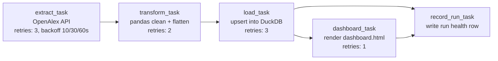

# OpenAlex ETL Pipeline

An automated, scheduled ETL pipeline that extracts academic citation data
from the [OpenAlex](https://openalex.org) API, cleans and reshapes it with
pandas, loads it into DuckDB, and publishes a static health/query
dashboard — orchestrated as a Prefect DAG with retries, failure handling,
and a daily GitHub Actions schedule.

Built as a portfolio project demonstrating data-engineering practices
(idempotent loads, retry/backoff, structured logging, pipeline-health
monitoring) beyond a one-off notebook analysis.

## Architecture



A rendered PNG of this same DAG is generated at `docs/dag.png` by
`scripts/generate_dag_diagram.py`.

**Data flow:** OpenAlex `/works` API → `data/raw/*.json` (landing zone) →
pandas cleaning → two tidy tables (`works`, `authors`) → DuckDB
(`db/openalex.duckdb`) → `dashboard/dashboard.html`.

**Failure handling:** every task has independent Prefect retries with
backoff. If a task exhausts its retries, the flow raises, is marked
`Failed` by Prefect, and — via the `timed_run()` context manager in
`pipeline/logging_utils.py` — a `RunSummary` is *still* written to
`logs/run_history.jsonl` (and, on next successful run, to the
`pipeline_runs` table) with `status=failed` and the `stage` it broke at.
That's what lets the dashboard show failed runs, not just successful ones.

## Project layout

```
openalex-etl/
├── pipeline/
│   ├── config.py          # all tunables, override via env vars
│   ├── extract.py         # OpenAlex API client, cursor pagination
│   ├── transform.py       # pandas cleaning/flattening
│   ├── load.py            # idempotent DuckDB upserts + schema
│   ├── logging_utils.py   # rotating log file + run-history JSONL
│   └── flow.py            # Prefect flow (the DAG)
├── dashboard/
│   └── generate_dashboard.py  # builds dashboard/dashboard.html
├── scripts/
│   └── generate_dag_diagram.py
├── tests/
│   ├── fixtures/sample_openalex_response.json
│   └── test_pipeline.py
├── .github/workflows/etl.yml   # daily schedule + manual trigger
├── data/{raw,processed}/       # landing zone (gitignored)
├── db/openalex.duckdb          # warehouse (created on first run)
├── logs/                       # pipeline.log + run_history.jsonl
└── requirements.txt
```

## Setup (macOS)

```bash
cd openalex-etl
python3 -m venv .venv
source .venv/bin/activate
pip install -r requirements.txt
```

## Running it

Run the whole pipeline once:

```bash
python -m pipeline.flow
```

This extracts works matching `OPENALEX_SEARCH_QUERY` (default: *"applied
artificial intelligence"*, years 2018–2025), cleans them, loads them into
`db/openalex.duckdb`, and regenerates `dashboard/dashboard.html`. Open the
dashboard file directly in your browser afterwards.

Run just the dashboard (against whatever is already in DuckDB):

```bash
python -m dashboard.generate_dashboard
```

Run the test suite (no network calls — uses a fixture + mocked HTTP):

```bash
pip install pytest
pytest tests/ -v
```

Regenerate the DAG diagram:

```bash
pip install matplotlib
python scripts/generate_dag_diagram.py
```

### Changing the dataset

Everything extract-related is an env var (see `pipeline/config.py`):

```bash
export OPENALEX_SEARCH_QUERY="blockchain consensus protocols"
export OPENALEX_FROM_YEAR=2015
export OPENALEX_TO_YEAR=2025
export OPENALEX_MAX_RECORDS=1000
python -m pipeline.flow
```

## Scheduling

Two ways to run this on a recurring basis, matching the tech-stack ask of
both an orchestrator schedule and GitHub Actions:

1. **GitHub Actions (recommended for this project)** — `.github/workflows/etl.yml`
   runs the pipeline daily at 06:00 UTC via `cron`, plus on-demand via
   `workflow_dispatch`. It installs dependencies, runs
   `python -m pipeline.flow`, uploads `logs/` and the dashboard as a build
   artifact, and commits the refreshed `db/openalex.duckdb` +
   `dashboard.html` back to the repo so the latest state is always on
   `main`. No server to keep alive — this is what actually executes on a
   schedule "for free."

2. **Native Prefect schedule** — for running on a machine you keep on
   (e.g. a home server or a small VM), Prefect can self-schedule:

   ```bash
   python -m pipeline.flow --serve --cron "0 6 * * *"
   ```

   This keeps a process alive that triggers a new flow run on that cron
   schedule and (if you run `prefect server start` separately) gives you
   the Prefect UI to watch runs, retries, and logs in real time.

## Monitoring / pipeline health

- `logs/pipeline.log` — rotating text log (5 × 2MB) with per-stage detail.
- `logs/run_history.jsonl` — one JSON record per run (`run_id`, timing,
  status, stage, row counts, error message if any).
- `pipeline_runs` table in DuckDB — the same run history, queryable with
  SQL alongside the data it produced, e.g.:

  ```sql
  SELECT status, COUNT(*) FROM pipeline_runs GROUP BY status;
  ```

- `dashboard/dashboard.html` — surfaces both: data summary cards (works
  loaded, distinct authors, total/avg citations), works-per-year chart,
  top-cited works, top concepts, top venues, **and** a pipeline run-history
  table (status, duration, rows processed, error message) so a red run
  is visible in the same place as the data it affected.

## Design notes / trade-offs

- **DuckDB over PostgreSQL:** chosen so the whole project runs
  self-contained on a laptop or CI runner with zero external services —
  swapping `duckdb.connect(path)` for a `psycopg2`/`sqlalchemy` connection
  in `pipeline/load.py` is the only change needed to point this at
  Postgres instead.
- **Idempotent loads:** `works` upserts on `work_id` (`INSERT OR REPLACE`);
  `authors` does delete-then-insert scoped to the touched `work_id`s. Re-
  running the same extract twice, or backfilling a past date range, never
  duplicates rows.
- **Static HTML dashboard over a live app:** this is a scheduled batch
  job, not a service — a self-contained HTML file regenerated each run is
  simpler to run in CI, commit to the repo, and open anywhere, with no
  server to keep patched and running.
- **Cursor pagination:** OpenAlex recommends cursor-based paging (rather
  than `page=N`) for walking deep into a result set reliably; `extract.py`
  implements that instead of naive page-number pagination.
